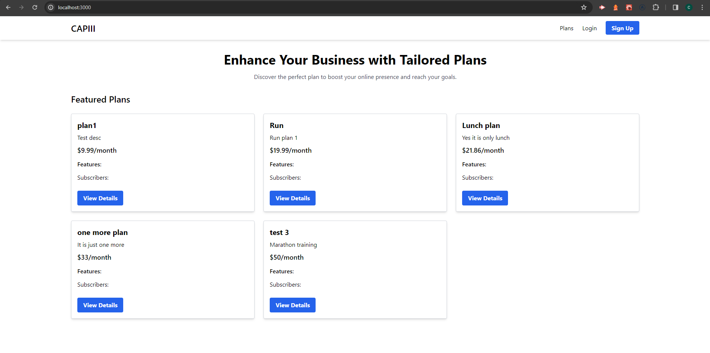

# Capiii

| Category           | Details                                              |
|-----------------------|----------------------------------------------------------|
| Description    | Capiii is a platform that bridges the gap between talented freelancers and users seeking diverse personalized services. Freelancers can showcase their expertise and offer various plans, such as study guides, meal plans, workout routines, and more. Users can conveniently discover, subscribe to, and manage these plans, all in one centralized location.  |

| Features 🌟       | Capiii features a clean and intuitive user interface, providing a seamless experience for users. The codebase follows the MVC framework, ensuring a well-structured and organized backend.   - User Accounts: Separate profiles for freelancers and users.   - Service Listings: Freelancers can create and manage their service offerings with detailed descriptions and pricing.   - Subscription Management: Users can easily discover, subscribe to, and manage multiple freelance plans from various provides. |
| Screenshots 🖼   |                                                          |
| Getting Started 🚀| 1. *Clone the repository: git@github.com:zaort/capiii.git   2. Navigate to the directory: cd capiii   3. Install the dependencies: npm install   4. Run server: npm run dev|
| Deployed app | ()   |
| License 📜       | This project is licensed under the MIT License. See the [LICENSE.md](./LICENSE.md) file for details. |
| Acknowledgements 👏 | Special thanks to all the open-source libraries and tools that made this project possible! |

## Technologies Used

- Frontend: The frontend of Todone is built using HTML, CSS, and JavaScript. HTML is used for structuring the web pages, CSS is used for styling and layout, and JavaScript is used for interactivity and dynamic behavior.

- Frontend: React, Tailwind CSS

- Backend: Node.js, Express.js, GraphQL
 
- Database: MongoDB, Mongoose ODM

- Authentication: JSON Web Token (JWT)

- Deployment: Render

## Contributing

Contributions are welcome, you can contact us for any suggestions or improvements.